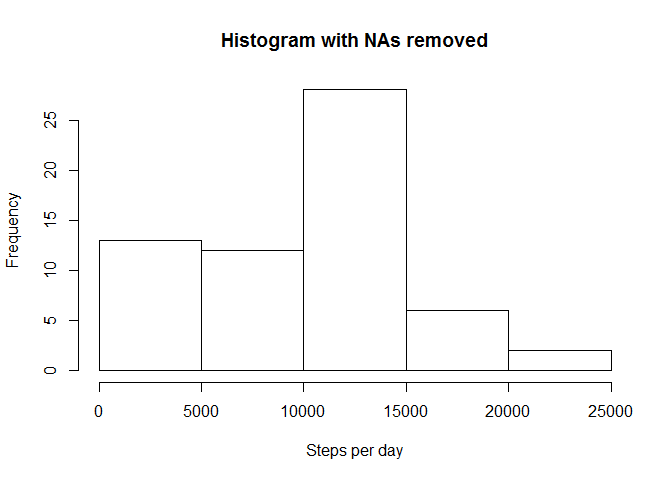
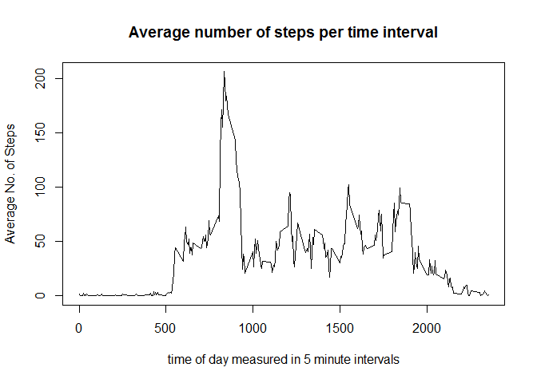
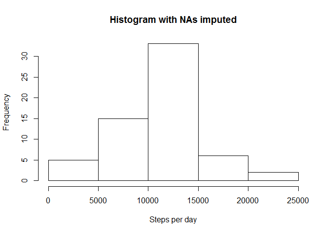
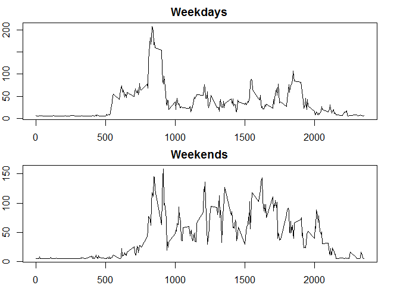

# Reproducible Research: Peer Assessment 1
EFO  
Thursday, November 15, 2014  

## Loading and preprocessing the Data

Let's begin by downloading the data to your current working directory and reading it into R.


```r
add<-"http://d396qusza40orc.cloudfront.net/repdata%2Fdata%2Factivity.zip"
dest<-"./repdata_data_activity.zip"
download.file(add, dest)
unzip(dest)
da_data<-read.csv("activity.csv")
```

Since we will be working with weekday names later on. Let's go ahead and create an extra column with them. (This will install the dplyr package in your computer if you don't have it already).


```r
if ("dplyr" %in% installed.packages() == FALSE){install.packages("dplyr")}
library(dplyr)
da_data<-tbl_df(da_data)
da_data<-mutate(da_data, weekday = weekdays(as.POSIXct(date)))
```

## What is the average total number of steps taken per day?

If you are reading this you probably know that the data comes from a person wearing a step tracking device for roughly two months. Let's take a look at the number of steps this person took per day.


```r
by_date<-group_by(da_data, date)
steps_per_day<-summarise(by_date, sum(steps, na.rm = TRUE))
hist(steps_per_day[,2], main = "Histogram with NAs removed", xlab= "Steps per day")
```

 

Note how asymmetrical the distribution looks. We set na.rm to TRUE and thus days with no data give us a total count of 0 steps instead of NA. We will deal with that later. For now let's calculate some typlical summary statistics for the number of steps per day.


```r
da_mean<-mean(steps_per_day[,2])
da_median<-median(steps_per_day[,2])
```

The average number of steps in a day is 9354.23 and the median is 10395. As you can see the mean is way off the mean. This indicates our data is [skewed](http://en.wikipedia.org/wiki/Skewness#Relationship_of_mean_and_median); another consequence of our patchy data set.

## What is the average daily activity pattern?

Now let's look at what an average day looks for our subject. Let's start by plotting a time series. 


```r
by_interval<-group_by(da_data, interval)
steps_by_interval<-summarise(by_interval, mean(steps, na.rm = TRUE))
plot(steps_by_interval[,1],steps_by_interval[,2], type ="l"
     , main = "Average number of steps per time interval"
     , xlab="time of day measured in 5 minute intervals", ylab = "Average No. of Steps")
```

 

Note that 

Now let's see at what time of day is our subject most active on average.


```r
max_index<-which.max(steps_by_interval[,2])
max_interval<-steps_by_interval[max_index,1]
max_value<-max(steps_by_interval[,2])
```

Interval no. 835 or, in other words, the interval from 8:35:00 to 8:39:59 AM was the most active with 206 steps on average.

## Imputing missing values

As said above, our data has days full of NAs. These missing data is messing up our results.


```r
NA_count<-sum(is.na(da_data$steps))
```

We have a total of 2304 missing observations. That is 13% of the data!

Maybe during these time periods the subject wasn't wearing the tracker or forgot to charge it. There's no use in speculating. Let's just patch our data with a conservative estimate. Let's assume that most Mondays resemble each other and that the same follows for all days of the week. Let's fill all these NAs with the average number of steps for that weekday.


```r
by_weekday<-group_by(da_data, weekday)
mean_steps_by_weekday<-summarise(by_weekday, mean(steps, na.rm = TRUE))
data_no_NAs<-da_data

for (i in seq_len(tally(data_no_NAs)$n)){
    for (j in seq_len(7)){
        if (data_no_NAs[i,4] == mean_steps_by_weekday[j,1] & 
                is.na(data_no_NAs[i,1])){
            data_no_NAs[i,1]<-mean_steps_by_weekday[j,2]
        }
    }
}
```

Now let's plot a histogram of the average number of steps per day again. 


```r
by_date_no_NAs<-group_by(data_no_NAs, date)
steps_per_day_no_NAs<-summarise(by_date_no_NAs, sum(steps))
hist(steps_per_day_no_NAs[,2], main ="Histogram with NAs imputed", xlab= "Steps per day")
```

 

As you can see, the leftmost bar has shrunken and now the whole graph looks more symmetrical and normally distributed. Now let's take a look at the mean and median.


```r
da_mean_no_NAs<-mean(steps_per_day_no_NAs[,2])
da_median_no_NAs<-median(steps_per_day_no_NAs[,2])
```

They have also slightly changed. The mean went from 9354 steps to 10821. The median went up from 10395 to 11015 steps per day. Our data is much less skewed now. (Though we could avoid all this trouble by just discarding the missing data points altogether).

## Are there differences in activity patterns between weekdays and weekends?

Are our subject's weekends different from her/his weekdays? Let's find out.


```r
weekdays<-filter(data_no_NAs, weekday != "Saturday" & weekday != "Sunday")
weekends<-filter(data_no_NAs, weekday == "Saturday" | weekday == "Sunday")

par(mfrow=c(2,1), mar=c(2,2,2,2))

weekdays_by_interval<-group_by(weekdays, interval)
weekday_steps_by_interval<-summarise(weekdays_by_interval, mean(steps))
plot(weekday_steps_by_interval[,1],weekday_steps_by_interval[,2], type ="l"
     , main = "Weekdays")

weekends_by_interval<-group_by(weekends, interval)
weekend_steps_by_interval<-summarise(weekends_by_interval, mean(steps))
plot(weekend_steps_by_interval[,1],weekend_steps_by_interval[,2], type ="l"
     , main = "Weekends")
```

 

It seems like our subject likes to take it a little bit easier on weekend mornings, but in general is more active throughout the day. It's hard to be sure just by looking at the plots. Let's see if that's true by comparing the average of total steps in both conditions.


```r
weekdays_by_date<-group_by(weekdays, date)
weekends_by_date<-group_by(weekends, date)
days<-summarise(weekdays_by_date, sum(steps))
ends<-summarise(weekends_by_date, sum(steps))
mean(days[,2])
```

```
## [1] 10257.53
```

```r
mean(ends[,2])
```

```
## [1] 12406.57
```

It's true. The subject is on average more active during the weekend. Let's do a [t-test](http://en.wikipedia.org/wiki/Student%27s_t-test) to determine if this difference is statistically significant.


```r
t.test(ends[,2], days[,2], paired = FALSE, var.equal = FALSE, alternative = "g")
```

```
## 
## 	Welch Two Sample t-test
## 
## data:  ends[, 2] and days[, 2]
## t = 2.6024, df = 55.165, p-value = 0.005933
## alternative hypothesis: true difference in means is greater than 0
## 95 percent confidence interval:
##  767.5131      Inf
## sample estimates:
## mean of x mean of y 
##  12406.57  10257.53
```

The total amount of steps our subject takes during weekends is significantly greater than the amount taken during weekdays. It seems our subject has exciting weekends. That's great.

There's more we could do with the data, but let's end this exercise here.
